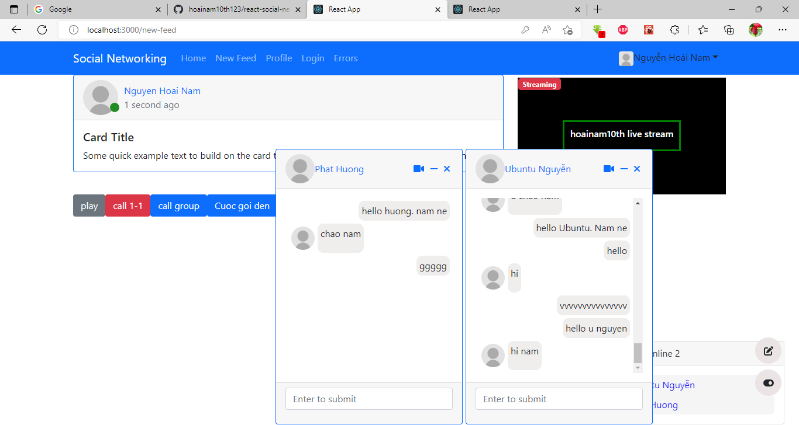

# react-social-network
## mạng xã hội đang làm dở. call video 1-1, chat 1-1
# FE (React 18)

<ol>
  <li>typescript</li>
  <li>Mobx for state managment</li>
  <li>Bootstrap UI</li>
  <li>Axios call API</li>
  <li>react-router-dom (v6)</li>
   <li>react-toastify (show notification)</li>
  <li>yup (validation)</li>
  <li>formik (form)</li>
  <li>mobx (state managment)</li>
  <li>signalr (real-time)</li>
  <li>fontawesome (ico)</li>
  <li>signalr (real-time)</li>
</ol>

# BE (.Net 6)

<ol>
  <li>SignalR</li>
  <li>Asp.Net Core Identity</li>
  <li>Code first migrations</li>
  <li>Sql server database</li>
  <li>UnitOfWork</li>
</ol>

# WebRTC (PeerJS) for call video

## xem thư mục Infrastructure\Data\Seed, để lấy tài khoản đăng nhập, đổi chuổi kết nối trong appsettings.json để chạy

